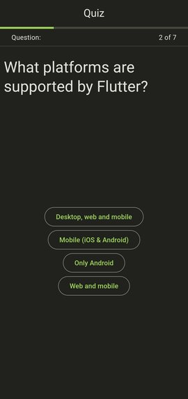
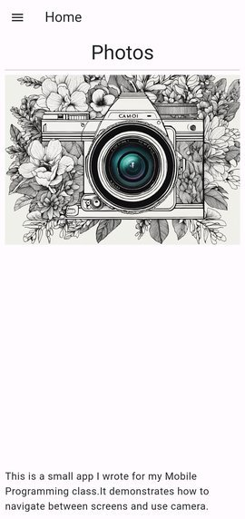
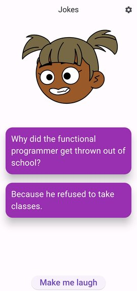
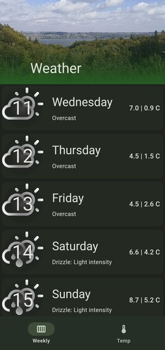

# Introduction to Fluttered

Welcome to **_Fluttered_**, a free online, interactive, exercise-driven
textbook on cross-platform mobile app development with Flutter.

## What is Flutter?

Flutter is a powerful UI toolkit from Google, for crafting natively compiled
applications for mobile, web, and desktop - all from a single codebase.

## Approach to teaching

This textbook is built around a hands-on, project-based approach.
By the end of this book, you'll have a portfolio of mini-apps and a strong
foundation to tackle larger, more complex projects.

These are examples of some of the apps you'll make.

## Who Is This Book For?

This book assumes basic programming knowledge but does not require any prior
experience with Flutter or mobile development.
If you have some understanding of object-oriented programming (OOP) and know
how to work with collections, you are ready to start.

The target audience is CS students and entry-level programmers.
However, experienced developers can also use it to gain insight into best
practices, patterns and architecture.

_Flutter and the related logo are trademarks of Google LLC. We are not endorsed by or affiliated with Google LLC._
_Dart and the related logo are trademarks of Google LLC. We are not endorsed by or affiliated with Google LLC._
