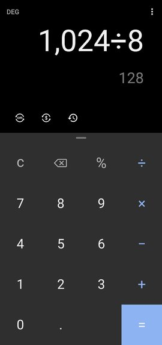

{}

# Challenge: Calculator

## Create a calculator layout

Create the interface for a calculator app.
You can use the image below as a reference.
The image is a screenshot of the actual calculator app on my own phone.

At this point I recommend you move over to writing your code in Android Studio
instead of DartPad.

{}
You don't have to match the image perfectly.
{}

## Bonus challenge

See if you can make the layout responsive.
It is probably easiest to test different sizes if you launch it in Chrome.

## Got stuck?

Take your time.
See if you can solve it yourself before you look at the solution.

{}
{}
{}
