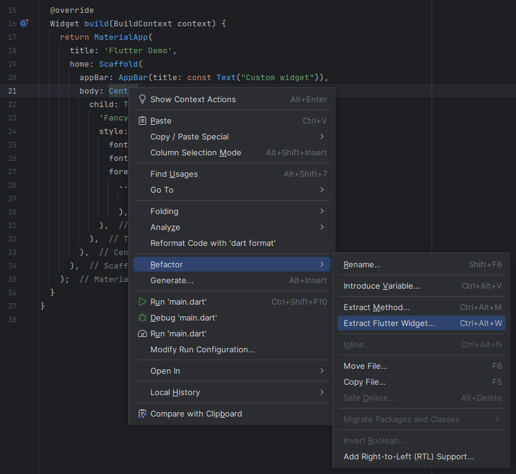



# Custom widgets

## Introduction

Now that you know about some of the built-in widgets in Flutter, it's time to
see how you can create your own reusable widgets.

All widgets are subclasses of [Widget
class](https://api.flutter.dev/flutter/widgets/Widget-class.html).

You normally won't subclass `Widget` directly.
Instead, you will, depending on the situation, use one of the following as your
base class:

- [StatelessWidget](https://api.flutter.dev/flutter/widgets/StatelessWidget-class.html)
- [StatefulWidget](https://api.flutter.dev/flutter/widgets/StatefulWidget-class.html)
- [InheritedWidget](https://api.flutter.dev/flutter/widgets/InheritedWidget-class.html)

For now, we will just focus on **StatelessWidget**.
You will learn about the others later on.

<iframe width="560" height="315" src="https://www.youtube.com/embed/wE7khGHVkYY?si=fmBpUb5a0zDBl5W-" title="YouTube video player" frameborder="0" allow="accelerometer; autoplay; clipboard-write; encrypted-media; gyroscope; picture-in-picture; web-share" referrerpolicy="strict-origin-when-cross-origin" allowfullscreen></iframe>

_Introduction to StatelessWidget made by Google some years ago._

## App widget

Instead of passing the entire widget tree to the `runApp()` function, most apps
wrap either `MaterialApp` or `CupertinoApp` in a custom widget.

```run-dartpad:theme-dark:mode-flutter:run-false:width-100%:height-600px
import 'package:flutter/material.dart';

void main() {
  runApp(MyApp());
}

class MyApp extends StatelessWidget {
  @override
  Widget build(BuildContext context) {
    return MaterialApp(
      title: 'Flutter Demo',
      home: Scaffold(
        appBar: AppBar(title: const Text("Custom widget")),
        body: const Center(
          child: Text(
            "Title",
            style: TextStyle(fontSize: 48),
          ),
        ),
      ),
    );
  }
}
```

`StatelessWidget` is an abstract class.
It has one abstract method we need to override.
That is the **build** method.
It returns a subtree of widgets.
Meaning, a custom widget can be composed of other widgets.

## Maintainability

Composing your app from custom widgets can have two huge benefits.
It helps structure your code by breaking your big app up into many smaller
chunks.
The other is to avoid having to repeat the same code over and over again.

To help illustrate better, here is a slightly more complicated example.

```run-dartpad:theme-dark:mode-flutter:run-false:width-100%:height-720px
import 'package:flutter/material.dart';

void main() {
  runApp(MyApp());
}

class MyApp extends StatelessWidget {
  final gradient = const LinearGradient(
    colors: [
      Color(0xffda44bb),
      Color(0xff01579c),
    ],
  );
  @override
  Widget build(BuildContext context) {
    return MaterialApp(
      title: 'Flutter Demo',
      home: Scaffold(
        appBar: AppBar(title: const Text("Custom widget")),
        body: Center(
          child: Text(
            'Fancy Title',
            style: TextStyle(
              fontSize: 36.0,
              fontWeight: FontWeight.bold,
              foreground: Paint()
                ..shader = gradient.createShader(
                  Rect.fromLTWH(1.0, 0.0, 200, 70.0),
                ),
            ),
          ),
        ),
      ),
    );
  }
}
```

A gradient is used to shade the text.
There are two problems with the example that we can solve by introducing
another widget.

1. The `gradient` field is used to shade the "Fancy Title" text, but it is not
   next to it.
2. What if we need to display several titles? Then we will have repeated code.

To fix the first problem, we will extract the title as its own widget.

```run-dartpad:theme-dark:mode-flutter:run-false:width-100%:height-720px
import 'package:flutter/material.dart';

void main() {
  runApp(MyApp());
}

class MyApp extends StatelessWidget {
  @override
  Widget build(BuildContext context) {
    return MaterialApp(
      title: 'Flutter Demo',
      home: Scaffold(
        appBar: AppBar(title: const Text("Custom widget")),
        body: FancyTitle(),
      ),
    );
  }
}

class FancyTitle extends StatelessWidget {
  final gradient = const LinearGradient(
    colors: [
      Color(0xffda44bb),
      Color(0xff01579c),
    ],
  );

  @override
  Widget build(BuildContext context) {
    return Center(
      child: Text(
        'Fancy Title',
        style: TextStyle(
          fontSize: 36.0,
          fontWeight: FontWeight.bold,
          foreground: Paint()
            ..shader = gradient.createShader(
              Rect.fromLTWH(1.0, 0.0, 200, 70.0),
            ),
        ),
      ),
    );
  }
}
```

{}

Extracting widgets is a pretty common operation.
So Android Studio got a option in context menu to do it for your.



**Note:** You might need to do some manual adjustments of the code afterward.

{}

To fix the second problem, we can turn the title text into a parameter for the
new `FancyTitle` widget.

```run-dartpad:theme-dark:mode-flutter:run-false:width-100%:height-720px
import 'package:flutter/material.dart';

void main() {
  runApp(MyApp());
}

class MyApp extends StatelessWidget {
  @override
  Widget build(BuildContext context) {
    return MaterialApp(
      title: 'Flutter Demo',
      home: Scaffold(
        appBar: AppBar(title: const Text("Custom widget")),
        body: Column(
          children: [
            FancyTitle("Title1"),
            FancyTitle("Title2"),
          ],
        ),
      ),
    );
  }
}

class FancyTitle extends StatelessWidget {
  final gradient = const LinearGradient(
    colors: [
      Color(0xffda44bb),
      Color(0xff01579c),
    ],
  );

  const FancyTitle(this.text, {super.key});

  final String text;

  @override
  Widget build(BuildContext context) {
    return Center(
      child: Text(
        text,
        style: TextStyle(
          fontSize: 36.0,
          fontWeight: FontWeight.bold,
          foreground: Paint()
            ..shader = gradient.createShader(
              Rect.fromLTWH(1.0, 0.0, 200, 70.0),
            ),
        ),
      ),
    );
  }
}
```

## Helper methods

Helpers methods can also be used to break down a large **build** method into
smaller chunks.
It can be seen as an alternative to introducing new custom widgets.
Here is a variation where the fancy title is defined with a helper method.

```run-dartpad:theme-dark:mode-flutter:run-false:width-100%:height-720px
import 'package:flutter/material.dart';

void main() {
  runApp(MyApp());
}

class MyApp extends StatelessWidget {
  @override
  Widget build(BuildContext context) {
    return MaterialApp(
      title: 'Flutter Demo',
      home: Scaffold(
        appBar: AppBar(title: const Text("Custom widget")),
        body: Column(
          children: [
            _buildFancyTitle("Title1"),
            _buildFancyTitle("Title2"),
          ],
        ),
      ),
    );
  }

  final gradient = const LinearGradient(
    colors: [
      Color(0xffda44bb),
      Color(0xff01579c),
    ],
  );

  Widget _buildFancyTitle(String text) {
    return Center(
      child: Text(
        text,
        style: TextStyle(
          fontSize: 36.0,
          fontWeight: FontWeight.bold,
          foreground: Paint()
            ..shader = gradient.createShader(
              Rect.fromLTWH(1.0, 0.0, 200, 70.0),
            ),
        ),
      ),
    );
  }
}
```

Using widgets over helper methods can have some advantages.
It allows the widget to be reused.
And in some situations it will actually perform better as well.
